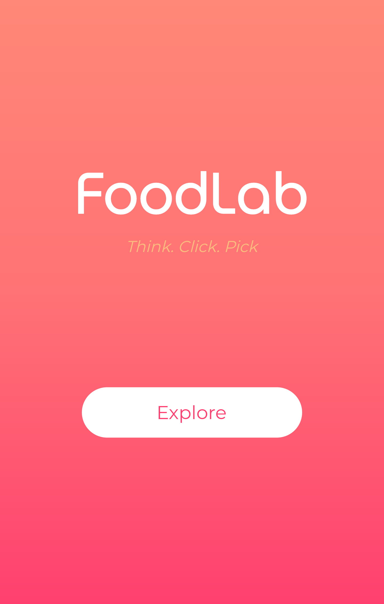
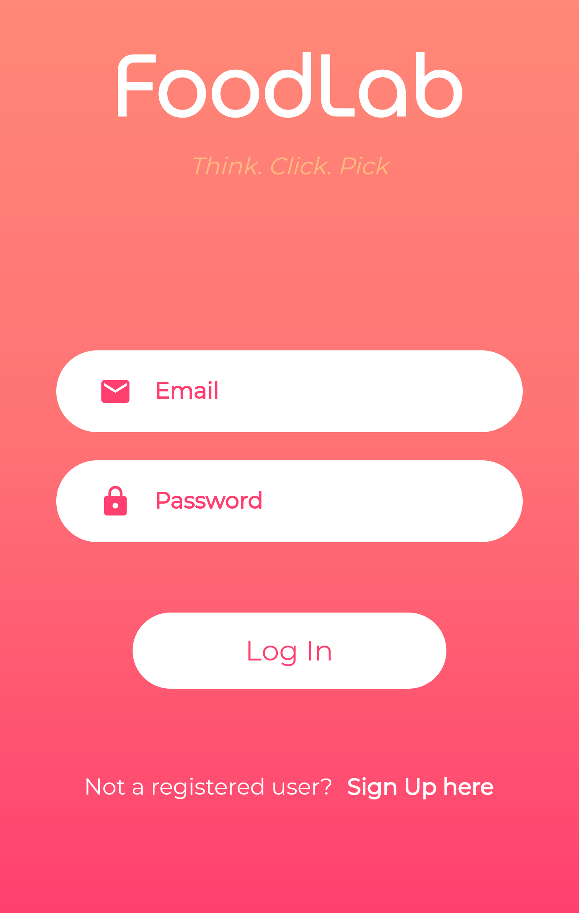
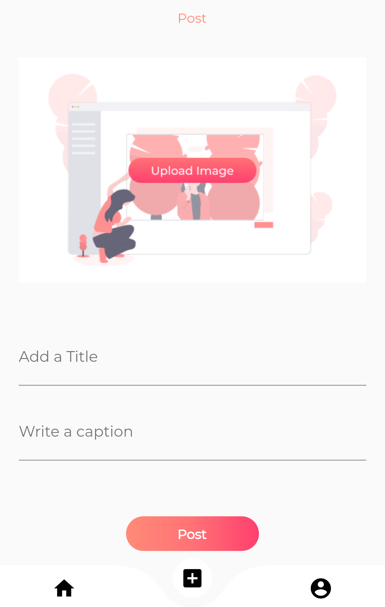

  

 
<i>A Food App using <a href="https://flutter.dev/">Flutter </a> & <a href="https://firebase.google.com/">Firebase </a>  </i>
  
  
## About the App 

  - Food-app is a App to post and view food blogs along with their recipes if you want !
  
  - Login or SignUp using any account (P.S. Your credentials are safe!)  and this will lead you to the feed page.
  
  - You can also build your own profile and you'll see other people's blogs in your feed, you can also see the detail steps to make a dish if the owner has         written it's recipe.
  
  - All the data is stored in Firebase. Because of real-time database you'll get the latest and yummy food blogs. Also, app uses Provider package for state     management.
  

  
## Screens 

  

## In Action 

  

  
